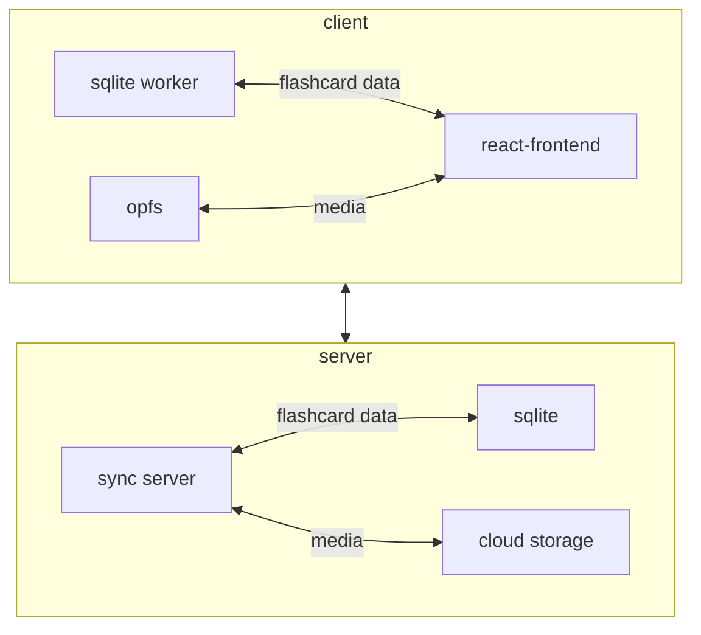

# Memothon

memothon is a spaced-repetition flashcard system designed for simplicity.

Features:
- Front and back cards each with one attached media file
- Markdown support + syntax highlighting
- Better card creation using AI tools
- Schedules reviews with enough spacing between them
- Offline first: you don't have to sync at all if you don't want to
- Self-hostable: everything is open source so you can host your own frontend or sync server
- Above all, simplicity to make the focus on your cards, not hyper-optimization

## Architecture

memothon follows an offline-first architecture.

The main frontend client should manage flashcard data in sqlite in OPFS, while media will be stored as flat files in OPFS.

If you want, you can sync it back to the backend, which will also be able to sync to other clients.

