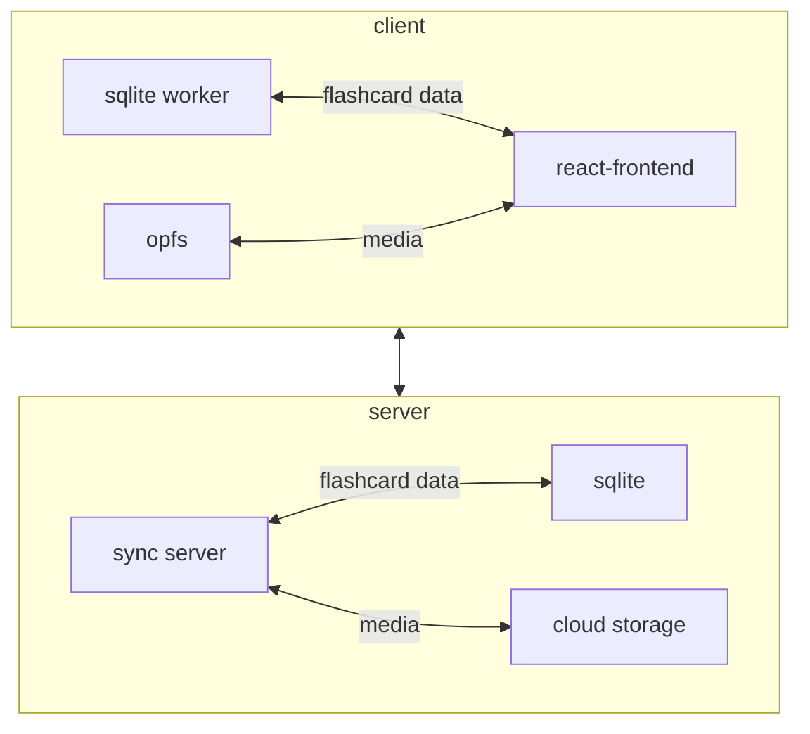

# Memothon

memothon is a spaced-repetition flashcard system designed for simplicity.

Features:
- Front and back cards each with one attached media file
- Markdown support + syntax highlighting
- Better card creation using AI tools
- Schedules reviews with enough spacing between them
- Offline first: you don't have to sync at all if you don't want to
- Self-hostable: everything is open source so you can host your own frontend or sync server
- Above all, simplicity to make the focus on your cards, not hyper-optimization

## Architecture

memothon follows an offline-first architecture.

The main frontend client should manage flashcard data in sqlite in OPFS, while media will be stored as flat files in OPFS.

If you want, you can sync it back to the backend, which will also be able to sync to other clients.

### Syncing

I have considered many different options for syncing.

Here are some criteria I'm evaluating on:

1. It should be easy to implement syncing for an arbitrary client.
You shouldn't have to have any special dependencies, you should be able to transact using HTTP APIs to exchange state.
2. I really don't want to be locked into a special framework that does the syncing piece, there's lots of risk there

So a few options I evaluated:

#### The session extension

The session extension of the sqlite API seems cool:
1. Everything is just a sqlite db!
2. You could sync files as blobs in columns as part of the changesets

but there's a few issues I have with it:

1. It's a one-way door. There's not a great way to migrate clients
off of using the sqlite session extension for exchanging deltas
2. It requires clients to enable the session extension to be able
to use the project, which is slightly cumbersome

Some unknowns I was worried about but didn't explore:

1. Is syncing big files really possible with changesets?
1. How easy is it to juggle changesets for many different clients?
1. How trivial is it to make sure we don't miss changes happening on a client if the user, say, closes the browser window right after making a change?

#### ElectricSQL / vlcn / tinybase

todo

#### Just files
